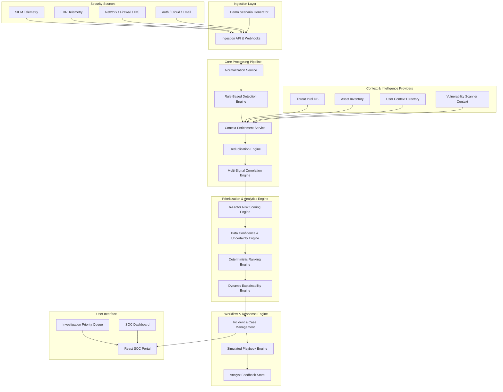
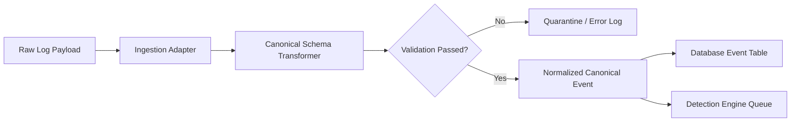
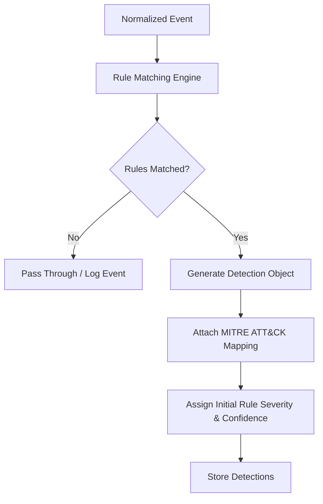
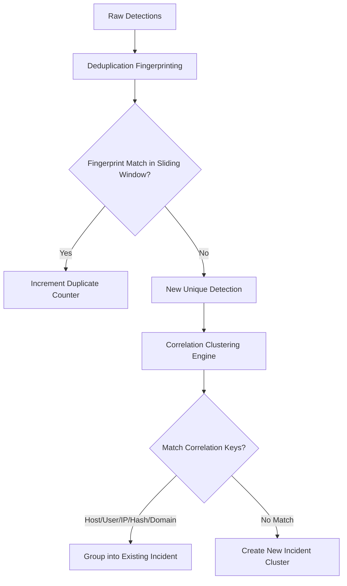
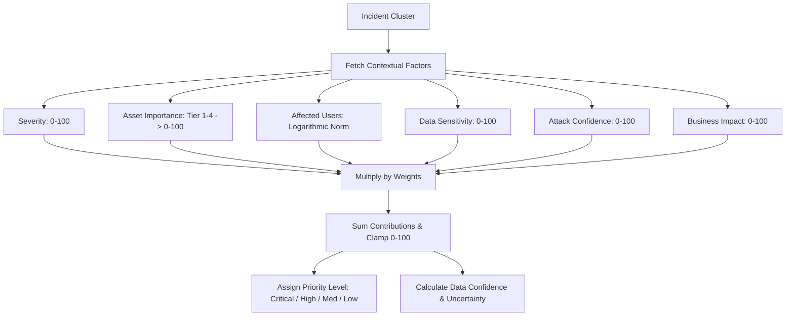
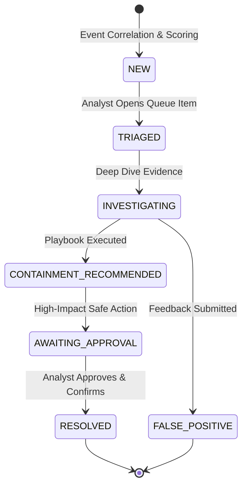
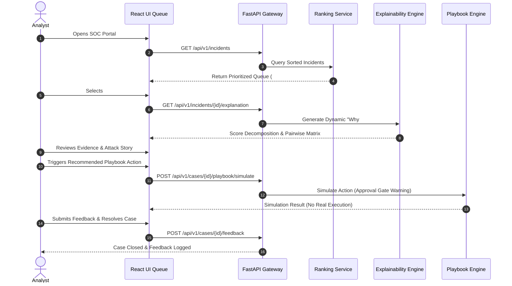

# CIP-SOC Architecture Specifications

This document outlines the complete architectural design and data pipelines for the **Cyber Incident Prioritization & SOC Intelligence Platform (CIP-SOC)**.

---

## 1. System Architecture

---

## 2. Event Pipeline

---

## 3. Detection Pipeline

---

## 4. Correlation Pipeline

---

## 5. Risk Scoring Pipeline

---

## 6. Incident Lifecycle

---

## 7. Analyst Workflow

